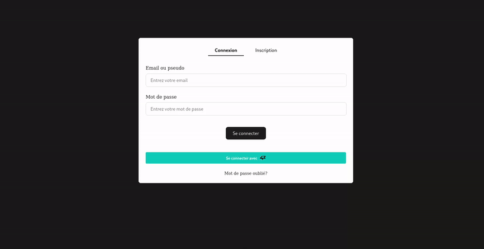
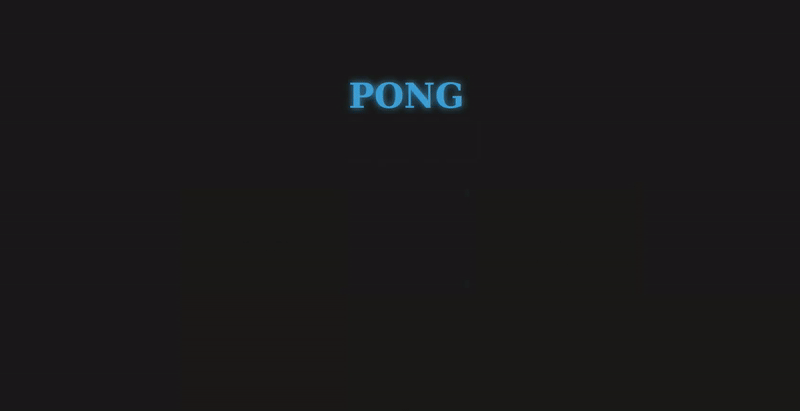
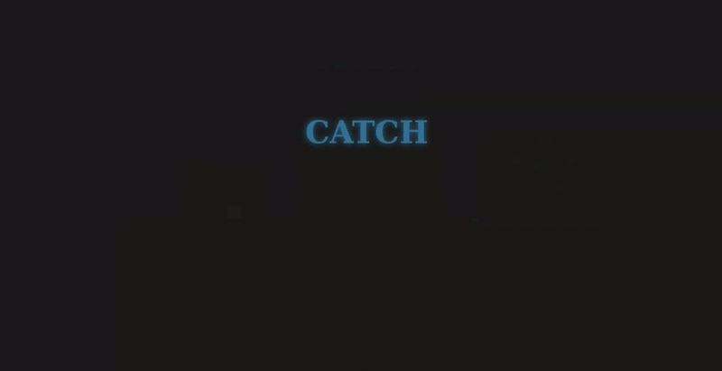
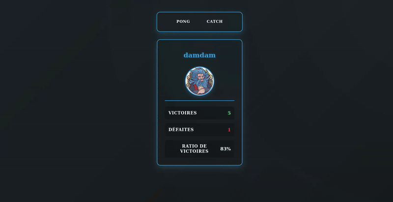
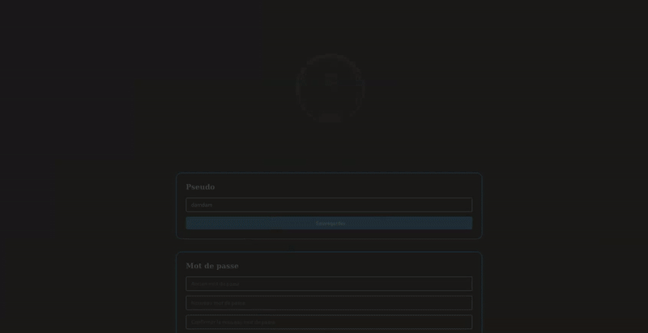

# 🌐 ft_transcendence

<div align="center">
  
  
  
  
</div>

## 🚀 Présentation du Projet

**ft_transcendence** avec [@Blackbill1](https://github.com/Blackbill1) & [@MoustacheDivine](https://github.com/MoustacheDivine)  
Projet issu de l’école 42 Le Havre, cette initiative vise à créer une plateforme en ligne offrant la possibilité de jouer à différents jeux, de communiquer avec d’autres utilisateurs et bien plus encore. De nombreuses fonctionnalités sont intégrées afin de simplifier la navigation et de favoriser les échanges entre membres de la communauté, garantissant ainsi une expérience fluide et immersive.

### ✨ Fonctionnalités Principales

- 🎮 **Jouer** : Lancer des parties de Pong ou de Catch, en mode solo ou jusqu'à 4 joueurs.
- 💬 **Communication** : Discuter avec vos amis et organisez des parties.
- 🔒 **Sécurité** : Se connecter de diverses manières, avec notamment la possibilité d'utiliser le 2FA.
- 📈 **Statistiques** : Consulter vos statistiques de jeu ou celles de vos amis.

## 🔧 Installation & Configuration

### 1. 🚀 Cloner le Projet

```bash
git clone https://github.com/DamdamMVP/ft_transcendence.git
cd ft_transcendence
```

## 2. 🛠️ Commandes Principales

| Commande        | Action                                   |
| --------------- | ---------------------------------------- |
| `npm run dev`   | 🚀 Démarrage du serveur de développement |
| `npm run build` | 🏗 Construction pour la production       |

## 🌐 Le site

### 1. 🏠 Accueil

- 🔑 Connexion / Inscription
- 🎓 Connexion avec l'API 42



### 2. 🏓 Pong

- 👥 Jouer en local 1vs1
- 🤖 Jouer contre l'IA
- 🏆 Jouer dans un tournoi



### 3. 🎯 Catch

- 👥 Jouer en local 1vs1
- 🤖 Jouer contre l'IA



### 4. 👤 Profil

- 📋 Consulter votre profil
- 📜 Consulter votre historique



### 5. 💬 Chat

- 👥 Afficher votre liste d'amis
- 💬 Chatter avec vos amis en privé ou dans un canal public
- ➕ Ajouter/Retirer/Bloquer des utilisateurs
- 🎮 Inviter vos amis à jouer


### 6. ⚙️ Paramètres

- 🖊️ Modifier vos informations personnelles
- 🚪 Déconnecter
- 🔐 Activer/Désactiver la 2FA
- 🕶️ Anonymiser votre compte
- 🗑️ Supprimer votre compte



## 🤝 Contribution

- 👤 **Collaborateurs**: [@Polybiuss](https://github.com/Polybiuss) & [@BLQuatre](https://github.com/BLQuatre)
